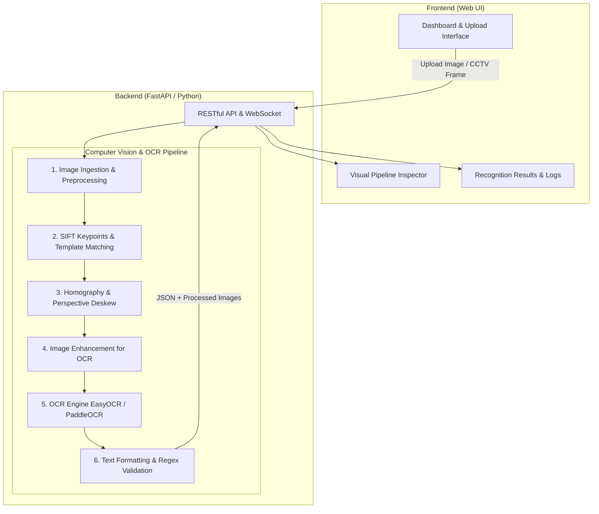

# แผนการพัฒนาเว็บแอปพลิเคชันตรวจจับและอ่านป้ายทะเบียนรถ (License Plate Recognition System)
**เทคโนโลยีหลัก:** SIFT (Scale-Invariant Feature Transform) + Homography Skew Correction + OCR

---

## 1. ภาพรวมโครงการ (Project Overview)
ระบบนี้เป็นเว็บแอปพลิเคชันสำหรับตรวจจับ ค้นหาตำแหน่ง ดัดแก้ความเอียง/มุมมอง (Perspective Deskew) และรู้จำตัวอักษรป้ายทะเบียนรถยนต์จากภาพนิ่งหรือกล้องวงจรปิด (CCTV) 

จุดเด่นของระบบคือ:
1. **การจับตำแหน่งด้วย SIFT (Feature Matching & Homography):** มีความทนทานต่อการเปลี่ยนแปลงขนาด (Scale), การหมุน (Rotation), ความสว่าง (Illumination), และมุมมองกล้อง
2. **การปรับภาพเอียงให้ตรง (Perspective Deskew):** ใช้ Homography Transformation แปลงป้ายทะเบียนที่เบี้ยวจากมุมกล้อง CCTV ให้กลับมาเป็นสี่เหลี่ยมผืนผ้าหน้าตรง 
3. **การอ่านป้ายทะเบียนด้วย OCR:** ประมวลผลภาพป้ายทะเบียนที่ตรงแล้วเข้าสู่โมเดล OCR (รองรับตัวอักษรไทย-อังกฤษ และตัวเลข) พร้อมระบบ Post-processing ตรวจสอบความถูกต้องตามฟอร์แมตทะเบียนรถ

---

## 2. โครงสร้างสถาปัตยกรรมระบบ (System Architecture)



---

## 3. ขั้นตอนการทำงานเชิงลึกของไปป์ไลน์ (Pipeline Stages)

### ขั้นตอนที่ 1: การตรวจหาตำแหน่งป้ายทะเบียนด้วย SIFT (SIFT Plate Localization)
* **ฐานข้อมูลเทมเพลต (Template Bank):** เตรียมภาพต้นแบบโครงสร้างป้ายทะเบียน (เช่น กรอบป้ายทะเบียน, ตราสัญลักษณ์, ตัวอักษรตัวอย่าง) หรือภาพเทมเพลตป้ายมาตรฐาน
* **การสกัดจุดเด่น (Feature Extraction):**
  * สกัด Keypoints และ Descriptors ของภาพนำเข้า (Input Image) และ Template ด้วย `cv2.SIFT_create()`
* **การจับคู่จุดเด่น (Feature Matching):**
  * ใช้ `FLANN Based Matcher` หรือ `BFMatcher (cv2.NORM_L2)`
  * กรองคู่จุดที่แม่นยำด้วย Lowe's Ratio Test ($d_1 / d_2 < 0.7$)
* **การประเมินตำแหน่ง (Homography Estimation):**
  * ใช้จุดคู่ที่ผ่านเกณฑ์คำนวณ Matrix Homography $H$ ด้วยอัลกอริทึม RANSAC (`cv2.findHomography(src_pts, dst_pts, cv2.RANSAC, 5.0)`)
  * ฉายมุมสี่เหลี่ยมของเทมเพลตป้ายลงบนภาพรถเพื่อระบุพิกัด 4 จุดมุมของป้ายทะเบียนในภาพจริง

---

### ขั้นตอนที่ 2: การดัดแก้ความเอียงและมุมมองภาพ (Perspective Deskewing)
ภาพจากกล้อง CCTV มักจะถ่ายจากมุมสูงหรือด้านข้าง ทำให้ป้ายทะเบียนมีลักษณะเป็นสี่เหลี่ยมคางหมูหรือบิดเบี้ยว (Perspective Distortion)

* **การหาจุดมุม (Corner Points Ordering):**
  * จัดเรียงจุดมุมทั้ง 4 พิกัด (Top-Left, Top-Right, Bottom-Right, Bottom-Left)
* **การคำนวณมิติมาตรฐาน (Target Dimensions):**
  * กำหนดอัตราส่วนป้ายทะเบียนมาตรฐาน (เช่น ป้ายทะเบียนไทยมีขนาดประมาณ 340 x 150 มม. $\approx$ อัตราส่วน 2.26 : 1)
  * ตั้งค่าขนาดปลายทาง เช่น ความกว้าง 400px, ความสูง 180px
* **การทำ Perspective Transform:**
  * คำนวณ Transformation Matrix: `cv2.getPerspectiveTransform(src_corners, dst_corners)`
  * ดัดภาพให้แบนและตรง: `cv2.warpPerspective(image, M, (width, height))`
* **Fine-Tuning Skew (ทางเลือกเพิ่มเติม):**
  * หากป้ายยังมีความเอียงของแนวบรรทัด จะใช้ Minimum Area Bounding Box หรือ Hough Line Transform ตรวจสอบองศาความเอียง ($\theta$) แล้วหมุนภาพย่อยปรับละเอียดอีกรอบ

---

### ขั้นตอนที่ 3: การปรับปรุงคุณภาพภาพก่อนทำ OCR (Image Enhancement)
* แปลงภาพป้ายทะเบียนที่ดัดตรงแล้วเป็นภาพขาวดำ (Grayscale)
* ปรับความคมชัดและแสงด้วย Contrast Limited Adaptive Histogram Equalization (CLAHE)
* ลบสัญญาณรบกวน (Noise Reduction) ด้วย Bilateral Filter เพื่อเก็บขอบตัวอักษรให้คมชัด
* ทำ Binarization (Otsu's Thresholding หรือ Adaptive Thresholding) เพื่อแยกพื้นหลังออกจากตัวอักษร

---

### ขั้นตอนที่ 4: การอ่านตัวอักษรและตรวจสอบความถูกต้อง (OCR & Post-Processing)
* **OCR Engine:**
  * ใช้ **EasyOCR** หรือ **PaddleOCR** (รองรับภาษาไทย `th` + ภาษาอังกฤษ `en` และตัวเลขได้ดีเยี่ยม)
* **Post-Processing & Validation:**
  * กรองข้อความด้วย Regular Expression ตามกฎหมายป้ายทะเบียน เช่น:
    * รถยนต์ส่วนบุคคล: `[1-9]?[ก-ฮ]{2}\s?[0-9]{1,4}` และบรรทัดล่างเป็นชื่อจังหวัด (เช่น "กรุงเทพมหานคร")
  * คำนวณ Confidence Score สำหรับผลการอ่านแต่ละตัวอักษร

---

## 4. สเปกหน้าจอและฟังก์ชันการทำงานของเว็บไซต์ (UI/UX Specifications)

หน้าเว็บออกแบบในสไตล์ **Modern Dark-Mode Industrial Dashboard** ดูทันสมัยและน่าเชื่อถือ

### 4.1 หน้าหลัก (Inspection & Dashboard)
1. **Source Input Zone:**
   * ลากและวางไฟล์ภาพ (Drag & Drop) รองรับ JPG, PNG, WEBP
   * ตัวเลือกต่อกล้องเว็บแคม (Webcam Live Feed)
   * ตัวเลือกระบุ URL สตรีมกล้อง CCTV (RTSP / HTTP Stream)
2. **Visual Pipeline Inspector (ไฮไลต์ของเว็บ):**
   * แสดงแท็บเปรียบเทียบผลลัพธ์ทีละสเต็ป เพื่อให้เห็นการทำงานของอัลกอริทึมอย่างชัดเจน:
     * **Tab 1: Original & SIFT Match:** แสดงภาพใหญ่พร้อมเส้นโยงคู่ Keypoints ระหว่าง Template และภาพรถ
     * **Tab 2: Detected Plate (Bound Box):** ตีกรอบ Polygon 4 จุดรอบป้ายทะเบียน
     * **Tab 3: Deskewed Plate:** ภาพป้ายทะเบียนที่ถูกยืด-ดัดมุมมองให้ตรง 100%
     * **Tab 4: Enhanced / Binarized:** ภาพหลังผ่านฟิลเตอร์ก่อนส่งเข้า OCR
3. **Recognition Result Card:**
   * แสดงข้อความป้ายทะเบียนตัวใหญ่ชัดเจน (เช่น `1กข 9999`)
   * ระบุชื่อจังหวัด (ถ้าอ่านได้)
   * แถบเปอร์เซ็นต์ความเชื่อมั่น (Confidence Score)
   * ปุ่มคัดลอกข้อความ (Copy to Clipboard)
   * ปุ่มแก้ไขด้วยตนเอง (Manual Edit) ในกรณีที่อ่านผิดพลาด
4. **Interactive Skew Adjuster (Manual Override):**
   * หากระบบ SIFT หาขอบภาพเอียงเกินไป ผู้ใช้สามารถลากเลื่อนจุด 4 มุม (Corner Pins) บนหน้าจอเพื่อดัดภาพสดๆ ได้ทันที
5. **Detection History & Export:**
   * ตารางประวัติการตรวจจับล่าสุดพร้อม Timestamp, ภาพ Thumbnail, ทะเบียนรถ, และปุ่ม Export เป็น CSV / Excel / JSON

---

## 5. แนะนำชุดเทคโนโลยี (Tech Stack Recommendation)

| ส่วนของระบบ | เทคโนโลยีที่แนะนำ | เหตุผล |
|---|---|---|
| **Backend Framework** | **FastAPI (Python 3.10+)** | ประสิทธิภาพสูง (Asynchronous), มี Swagger UI ในตัว, เชื่อมต่อกับ OpenCV ได้ง่ายที่สุด |
| **Computer Vision** | **OpenCV (`opencv-python` / `opencv-contrib-python`)** | มีอัลกอริทึม `SIFT`, `findHomography`, `warpPerspective` ครบครันและเร็ว |
| **OCR Engine** | **EasyOCR** หรือ **PaddleOCR** | รองรับภาษาไทย ภาษาอังกฤษ และตัวเลขได้แม่นยำสูง |
| **Frontend Framework** | **React / Vite + TailwindCSS** หรือ **Vanilla HTML/CSS/JS** | โหลดเร็ว หน้าตาทันสมัย แสดงผล Canvas และ Interactive จุด 4 มุมได้ลื่นไหล |
| **Icons & Design** | **Lucide Icons + Inter/Kanit Font** | เรียบหรู เหมาะกับงาน Dashboard ระบบอัจฉริยะ |

---

## 6. โครงสร้างโฟลเดอร์โปรเจกต์ (Project Directory Structure)

```text
CCTV SIFT method/
├── backend/
│   ├── app/
│   │   ├── __init__.py
│   │   ├── main.py                   # FastAPI Application Entrypoint
│   │   ├── api/
│   │   │   └── routes.py             # API Endpoints (/detect, /deskew, /ocr)
│   │   ├── core/
│   │   │   ├── sift_detector.py      # SIFT Keypoints & Template Matching
│   │   │   ├── deskew.py             # Homography & Perspective Transform
│   │   │   ├── preprocessor.py       # Grayscale, CLAHE, Thresholding
│   │   │   └── ocr_engine.py         # EasyOCR/PaddleOCR Wrapper & Regex
│   │   └── templates/                # ภาพ Template ป้ายทะเบียนมาตรฐานสำหรับจับคู่ SIFT
│   │       ├── thai_plate_standard.png
│   │       └── plate_features.npz    # บันทึก SIFT descriptors ล่วงหน้าเพื่อความเร็ว
│   ├── requirements.txt
│   └── test_sample/                  # ภาพตัวอย่างรถและกล้อง CCTV สำหรับทดสอบ
├── frontend/
│   ├── index.html                    # หน้าเว็บหลัก
│   ├── css/
│   │   └── style.css                 # สไตล์ Modern Dark Theme
│   └── js/
│       ├── app.js                    # ควบคุม Logic การอัปโหลดและการแสดงผล
│       ├── canvas_viewer.js          # วาดเส้น SIFT และ Corner Pin Interactive
│       └── api_client.js             # ติดต่อกับ FastAPI Backend
└── IMPLEMENTATION_PLAN.md            # เอกสารแผนการพัฒนานี้
```

---

## 7. รายละเอียดการออกแบบ API (API Specifications)

### 1. `POST /api/v1/recognize`
* **คำอธิบาย:** รับภาพรถยนต์ ประมวลผลรวดเดียวตั้งแต่ SIFT $\rightarrow$ Deskew $\rightarrow$ OCR แล้วส่งผลลัพธ์กลับ
* **Input (multipart/form-data):**
  * `file`: Binary Image (JPG, PNG)
* **Response (JSON):**
  ```json
  {
    "status": "success",
    "processing_time_ms": 240,
    "plate_found": true,
    "corners": [[120, 340], [450, 320], [440, 410], [110, 425]],
    "deskewed_plate_base64": "data:image/jpeg;base64,...",
    "visualization_base64": "data:image/jpeg;base64,...",
    "ocr_result": {
      "text": "1กข 9999",
      "province": "กรุงเทพมหานคร",
      "confidence": 0.94
    }
  }
  ```

### 2. `POST /api/v1/interactive-deskew`
* **คำอธิบาย:** เมื่อผู้ใช้ปรับพิกัด 4 จุดมุมด้วยตนเองบนหน้าเว็บ ส่งพิกัดมาเพื่อทำการ Warp และอ่าน OCR ใหม่เฉพาะจุดนั้น
* **Input (JSON):**
  * `image_id`: รหัสอ้างอิงภาพ
  * `corners`: `[[x1, y1], [x2, y2], [x3, y3], [x4, y4]]`
* **Response (JSON):**
  * `deskewed_image_base64`: ภาพป้ายที่ตัดและดัดตรงใหม่
  * `ocr_result`: ผลการอ่านข้อความรอบใหม่

---

## 8. แผนการดำเนินงานตามลำดับเฟส (Implementation Roadmap)

| เฟส (Phase) | รายละเอียดงาน | ผลลัพธ์ที่ได้ (Deliverables) |
|---|---|---|
| **Phase 1: Proof of Concept (Core Algorithm)** | - เตรียมภาพเทมเพลตป้ายทะเบียน<br>- เขียนสคริปต์ Python ทดสอบ SIFT Matching + Homography<br>- ทดสอบฟังก์ชัน Perspective Warp แก้ป้ายเบี้ยว<br>- ทดสอบ EasyOCR กับป้ายทะเบียนไทย | สคริปต์ `test_pipeline.py` สามารถรันจับภาพและอ่านตัวเลขได้บนรูปตัวอย่าง |
| **Phase 2: Backend Development (FastAPI)** | - พัฒนา REST API ครบทุกฟังก์ชัน (/recognize, /interactive-deskew)<br>- จัดการ Image Preprocessing ให้รวดเร็ว<br>- ทำแคช SIFT Descriptors ของเทมเพลตเพื่อลดเวลาคำนวณ | Backend API พร้อม Swagger Documentation |
| **Phase 3: Frontend Web Development** | - ออกแบบ UI สไตล์ Dark Theme ให้สวยงามระดับมืออาชีพ<br>- ทำระบบ Drag & Drop อัปโหลดภาพ<br>- ทำ Visual Pipeline แสดงภาพขั้นตอนต่างๆ<br>- ทำ Interactive Corner Pin ปรับจุด 4 มุมบน Canvas | หน้าเว็บสมบูรณ์ เชื่อมต่อกับ Backend ผ่าน Fetch API |
| **Phase 4: Robustness & Optimization** | - รองรับป้ายทะเบียนในสภาพแสงมืด / แสงสะท้อน<br>- ปรับแต่ง Thresholding เพื่อให้อ่านตัวอักษรได้คมชัดที่สุด<br>- เพิ่มระบบกรอง Regex สำหรับทะเบียนไทย | ระบบมีความแม่นยำสูงขึ้น รองรับภาพมุมเอียงหลายรูปแบบ |
| **Phase 5: Extended Features** | - เชื่อมต่อสตรีมกล้อง CCTV/Webcam แบบ Real-time<br>- ส่งออกรายงานเป็น CSV/Excel | ระบบพร้อมใช้งานจริงสำหรับตรวจจับรถเข้า-ออก |

---

## 9. ข้อพิจารณาและแนวทางแก้ปัญหาทางเทคนิค (Challenges & Solutions)

1. **ป้ายทะเบียนมีมุมเอียงจัด หรือรถอยู่ไกลมาก:**
   * *ปัญหา:* จุด Keypoints ของ SIFT อาจมีจำนวนน้อยเกินไปที่จะหา Homography ที่เสถียร
   * *แนวทางแก้ไข:* ทำ Multi-scale Template Matching หรือใช้ร่วมกับ Color Segmentation (ค้นหากรอบสีขาวของป้าย) เพื่อช่วยตีกรอบเบื้องต้นก่อนสกัดจุด SIFT
2. **ความเร็วในการประมวลผล (Performance):**
   * *ปัญหา:* SIFT คำนวณค่อนข้างช้าหากภาพมีความละเอียดสูงมากระดับ 4K
   * *แนวทางแก้ไข:* ย่อขนาดภาพสำหรับการตรวจหาตำแหน่งป้าย (Downscale for detection) เช่น ความกว้างไม่เกิน 1024px แล้วนำพิกัดที่ได้ไปคำนวณ Scale คืนบนภาพความละเอียดสูงก่อนทำการ Crop และ Warp
3. **ความถูกต้องของตัวอักษรภาษาไทยใน OCR:**
   * *ปัญหา:* สระและวรรณยุกต์ หรือตัวอักษรที่คล้ายกัน (เช่น ฎ กับ ฏ, ข กับ ช)
   * *แนวทางแก้ไข:* ใช้ Morphological Operations ขจัดจุดรบกวน และใช้ตารางแมปคำจังหวัดภาษาไทยมาตรฐาน 77 จังหวัดเพื่อทำ Auto-Correction
